# Identification And Categorization Of Toxic Twitter Posts Via Clustering

## Foreword

This research was conducted between 1st November 2019 and 22nd January 2020 by Alexandros Kornilakis (University of Crete, FORTH-ICS institute) and Andrew Patel (F-Secure Corporation) as part of EU Horizon 2020 projects PROTASIS and SHERPA. SHERPA is an EU-funded project which analyses how AI and big data analytics impact ethics and human rights. PROTASIS is a project that aims to expand the reach of systems security to the international community via joint research efforts.

## Introduction

Anyone who's read comments sections on news sites, looked at replies to social media posts authored by politicians, or read comments on YouTube will appreciate that there's a great deal of toxicity on the internet. Social media posts authored by politicians, journalists, and news organizations receive large numbers of angry or downright toxic replies from people who don't support their views. Some of these replies originate from fake accounts that have been created for the express purpose of trolling - the process of posting controversial comments designed to provoke emotional reactions and start fights. Trolling is a highly efficient way to spread rumors and disinformation, alter public opinion, and disrupt otherwise meaningful conversation, and, as such, is a tool often used by organized groups of political activists, commercial troll farms, and nation state disinformation campaigns.

On Twitter, troll accounts sometimes use a technique called reply-spamming to fish for engagement. This technique involves replying to a large number of high-profile accounts with the same or similar messages. This achieves two goals. The first is organic visibility - many people read replies to posts from politicians, and thus may read the post from the troll account. The second is social engineering – people get angry and reply to the troll’s posts, and occasionally the owner of the high-profile account may be tricked into engaging with the post themselves. Although high-profile accounts are rarely engaged by such tactics, there are examples of it happening. Recently, a parody account named Shaniqua O'Toole, claiming to be a Guardian journalist, managed to gain engagement from a few high-profile verified Twitter accounts by posting replies to their tweets that contained fake screenshots that looked like headlines on The Guardian's website.

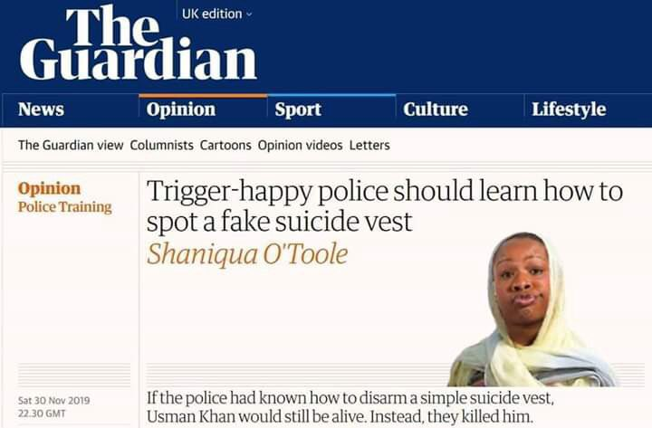

*Above: an example of a fake Guardian headline containing parody columnist “Shaniqua O’Toole”*

Reply-spam was also used to successfully propagate disinformation during the run-up to the December 2019 UK general election. One such occasion involved a situation where a journalist attempted to show a picture of a child sleeping on the floor of an overcrowded hospital to Boris Johnson during a television interview. Instead of looking at the picture, Johnson pocketed the reporter's phone and attempted to change the subject of their conversation. A clip of the interview went viral on social media, and shortly after, a large number of accounts published posts on various social networks, including Facebook and Twitter, claiming to be an acquaintance of one of the senior nurses at the hospital, and that the aforementioned nurse could verify that the picture was faked (https://twitter.com/marcowenjones/status/1204183081009262592).

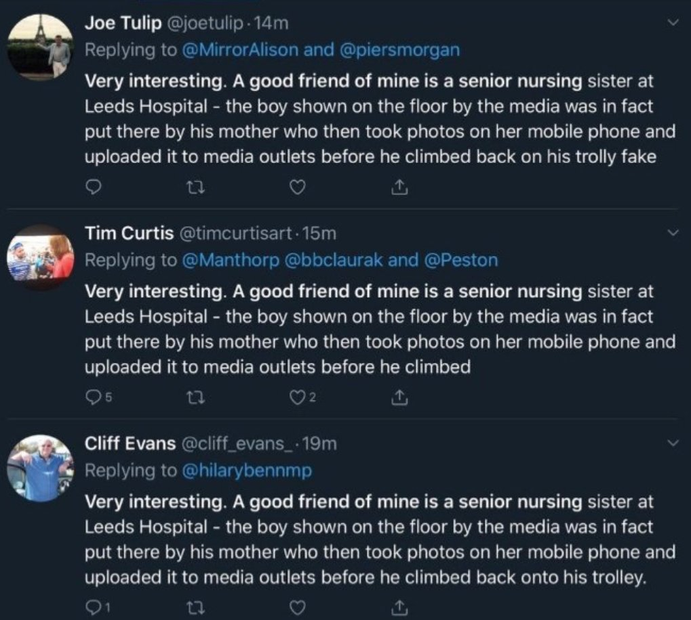

*Above: some of the original reply spam tweets regarding the Leeds Hospital incident. Note how they are all replies to politicians and journalists.*

*Above: tory activists on Twitter reinforced the original campaign with more copy-paste reply spam content*

*Above: this was shortly followed by a second campaign containing a different tweet that was also copy-pasted across social networks*

Many of the accounts that posted this content on Twitter were created specifically for that purpose, and deleted shortly afterwards (https://twitter.com/r0zetta/status/1204519439640801280). The story itself, including the picture, had appeared a week prior to the interview with Johnson in a local newspaper, and at that time, both the story and picture had been verified with personnel at the hospital. However, the fake social media posts were amplified to such a degree that voters, including those living in Leeds, believed that the picture had been faked. At least on Twitter, this disinformation was spread using reply-spam aimed at posts authored by politicians and journalists.

During the run-up to the 2019 UK general elections, posts on social networks were enough to propagate false information. Very few traditional "fake news" sites were uncovered, and it is unlikely that those that were found had any significant impact. Fake news sites are traditionally created in order to give legitimacy to fabricated, "clickbait" headlines. However, people are often inclined to share a headline without even visiting the original article. As such, fake news sites are rarely necessary. Nowadays, it is often enough to simply post something emotionally appealing on a social network, promote it enough to reach a handful of people, and then sit back and watch as it is organically disseminated by proxy. Once a rumor or lie has been spread in this manner, it enters the public’s consciousness, and can be difficult to later refute, even if the initial claim is debunked (https://twitter.com/r0zetta/status/1210499949064052737).

Anyone who runs a prominent social media account is unlikely to be able to find relevant or interesting replies to content they've posted due to the fact that they must wade through hundreds or even thousands of replies, many of which are toxic. This essentially amounts to an informational denial of service for both the account owner, and anyone with a genuine need to contact them. Well-established anti-spam systems exist to assist users with this problem for email, but no such system exists for social networks. Since notification interfaces on most social networks don't scale well for highly engaged accounts that receive many replies and direct messages, an automated filtering system would be a more than welcome addition.

Detection of unwanted textual content such as email spam and hate speech is a much easier task than detecting nuances in language indicative of negativity or toxicity. Spam messages typically follow patterns that can be accurately separated with clustering techniques or even regular expressions. Hate speech often contains words that are rarely used outside of their context, and hence can be successfully detected with string matches and other relatively simple techniques. One might assume that sentiment analysis techniques could be used to find toxic content, but they are, unfortunately, still rather inaccurate on real-world data. They often fail to understand the fact that the context of a word can drastically alter its meaning (e.g. "You're a rotten crook" versus "You’ll beat that crook in the next election"). Although accurate sentiment analysis techniques may eventually be of use in this area, software designed to filter toxic comments may require more metadata (such as the subject matter, or topic of the message) in order to perform accurately, or to provide a better explanation as to why certain messages were filtered.

The ability to accurately cluster social media posts by content and topic can greatly facilitate further analysis tasks such as searches for phenomena such as porn spam, reply-spam-based propaganda, and messages being artificially amplified by organized disinformation groups. Furthermore, the results of accurate clustering and topic modeling can be fed into downstream tasks such as:

  - systems designed to fact-check posts and comments

  - systems designed to detect and track rumors and the spread of disinformation, hoaxes, scams, and fake news

  - systems designed to identify the political stance of content published by one or more accounts

  - systems designed to quantify public opinion and assess the impact of social media on public opinion

  - trust analysis tasks (including those used to determine the quality of accounts on social networks)

  - the creation of disinformation knowledge base and datasets

  - detection of bots or spam publishers

To this end, we have attempted to build a system that is capable of clustering the type of written content typically encountered on social networks (or more specifically, on Twitter). Our experiments focus on tweets posted in reply to content authored by prominent US politicians and presidential candidates. 

## Experiments

We started by collecting two datasets:

### Set 1: US Democrats

The first set captured direct replies to tweets published by a number of highly engaged democrat-affiliated Twitter accounts - @JoeBiden, @SenSanders, @BernieSanders, @SenWarren, @ewarren, @PeteButtigieg, @MikeBloomberg, @amyklobuchar, @AndrewYang and @AOC - between Sun Dec 15 2019 and Mon Jan 13 2020. A total of 978,721 tweets were collected during this period. After preprocessing, a total of 719,617 tweets remained.

### Set 2: Donald Trump

The second set captured direct replies to tweets published by @realDonaldTrump between Sun Dec 15 2019 and Wed Jan 08 2020. A total of 4,940,317 tweets were collected during this period. Due to the discrepancy between the sizes of the two collected datasets, we opted to utilize a portion of this set containing 1,022,824 tweets. After preprocessing, a total of 747,232 tweets remained.

Our clustering methodology involved preprocessing of captured data, converting tweets into sentence vectors (using different techniques), combining those vectors into meta embeddings, and then creating node-edge graphs using similarities between calculated meta embeddings. Clusters were then derived by performing community detection on the resulting graphs. A detailed description of our methodology can be found in appendix 1 of this article.

Our first experiment involved clustering of a subset of data in set 1 (US democrats). We clustered a batch of 34,003 tweets, resulting in 209 clusters. We created an interactive demo using results of this clustering experiment that can be found here: https://twitter-clustering.web.app/ Note that this interactive demo will not display correctly on mobile browsers, so we encourage you to visit it from a desktop computer. Use the scroll wheel to zoom in and out of the visualization space, left-click and drag to move the nodes around, and click on nodes or communities themselves to see details. Details include names of accounts that were replied to the most in tweets assigned to that cluster, subject-verb-object triplets and overall sentiment extracted from those tweets, and the two most relevant tweets, loaded on the right of the screen, as examples. Different communities related to different topics (e.g. Community 2 contains clusters relevant to recent events in Iran).

We ran sentiment analysis on each cluster by taking the average sentiment calculated across all tweets contained in the cluster. Sentiment analysis was performed with TextBlob’s lexical sentiment analyzer. We then summarized negative and positive groups of clusters by counting words, ngrams, and which account was replied to. We also extracted subject-verb-object triplets from clusters using the textacy python module.

Note how, in the above, sentiment analysis has incorrectly categorized “you will never be president” as positive.

As you can see in the above, negative clusters outnumbered positive clusters by a factor of three. However, this simple analysis isn’t all that accurate due to problems with the sentiment analysis methodology.

The following pie chart contains summaries of some of the larger clusters identified. Most of the larger clusters contained negative replies, including common themes such as:

  - you are an idiot/moron/liar/traitor (or similar)

  - you will never be president

  - Trump will win the next election

Positive themes included:

  - We love you

  - You got this

  - You have my vote

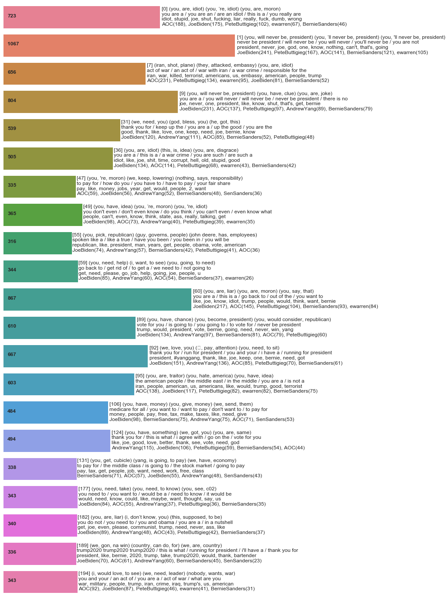

Several clusters contained replies directed at just one account. They contained either replies to specific content posted by that account, or comments specifically directed at the politician’s history or personal life, including the following:

  - Comments about Joe Biden’s son

  - Replies to Pete Buttigieg correcting him on a tweet about Jesus being a refugee

  - Comments about Joe Biden’s involvement in the Ukraine

  - Comments about Pete Buttigieg’s net worth, and something about expensive wine

  - Highly positive replies to Andrew Yang’s posts

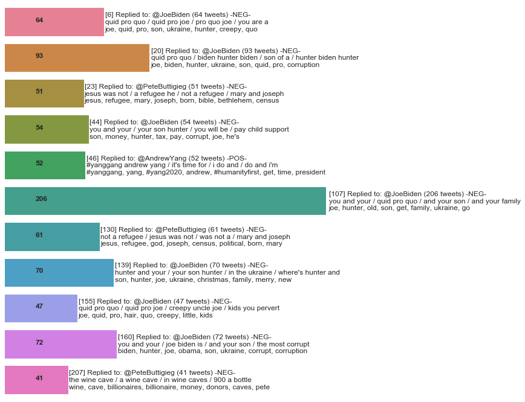

---

### Noteworthy clusters

*Above: two discovered clusters – one containing toxic replies, and another containing praise*

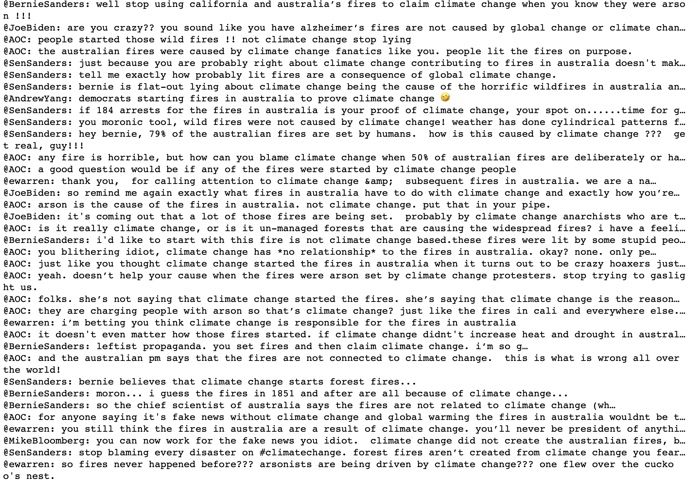

*The above discovered cluster contains accounts propagating a hoax that the 2019 bushfires in Australia were caused by arsonists*

*Above is one of a few clusters containing replies only to Pete Buttigieg, where Twitter users state that Jesus wasn’t a refugee*

*The cluster shown above contains positive comments to democratic presidential candidates that were posted after a debate*

---

Our second experiment involved clustering of a subset of data in set 2 (@realDonaldTrump). We processed a batch of 30,044 tweets, resulting in 209 clusters. Using the same methodology as in our first experiment, we separated the clusters into positive and negative, and summarized them.

Positive clusters included both statements of thanks and wishes of Merry Christmas and a Happy New Year. However, “you are a puppet” was incorrectly considered positive by sentiment analysis.

A summarization of negative clusters didn’t find any obvious false-positives. It includes themes such as recent impeachment hearings, and comments on the amount of time the president has spent playing golf.

Again, negative clusters are roughly three times more prevalent than positive ones.

Here are some details from the larger identified clusters. They include the following negative themes:

  - You are an idiot/liar/disgrace/criminal/\#impotus

  - You are not our president

  - You have no idea / you know nothing

  - You should just shut up

  - You can’t stop lying

  - References to Vladimir Putin

Here are some of the positive themes identified in these larger clusters:

  - God bless you, Mr. President

  - We love you

  - You are the best president

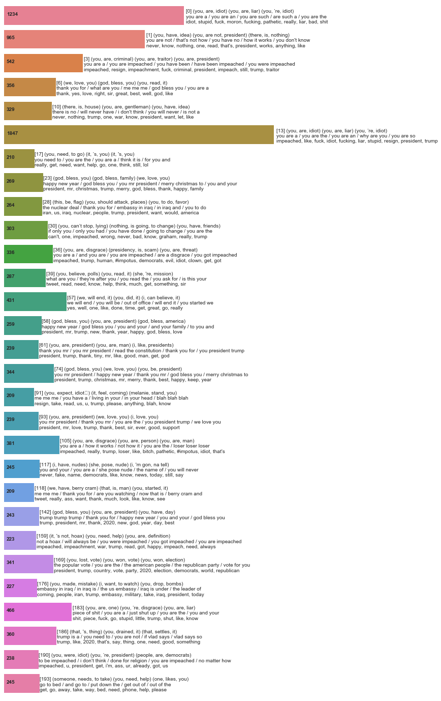

---

### Noteworthy clusters

*Above and below are Christmas-themed clusters, but with quite different messages. The one above contains mostly season’s greetings, whilst the one below contains some questions to Trump about his plans for the holidays.*

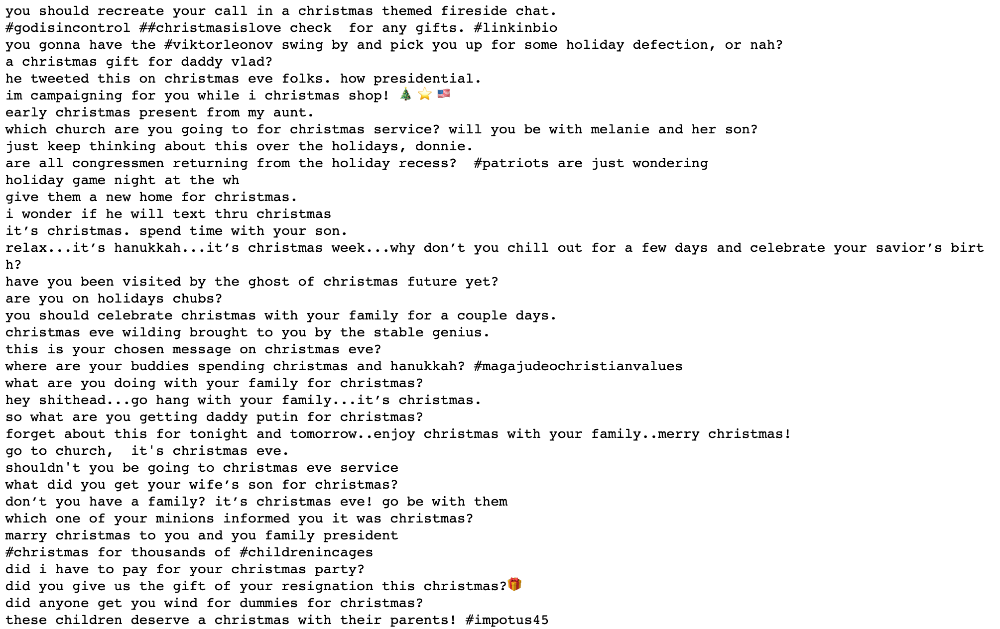

*Below is a cluster that found a bunch of “pot calls the kettle black” phraseology. Note how it captures quite different phrases such as “name is pot and he says you’re black”, “kettle meet black”, “pot and kettle situation” and so on. It did fail on that one tweet that references blackface.*

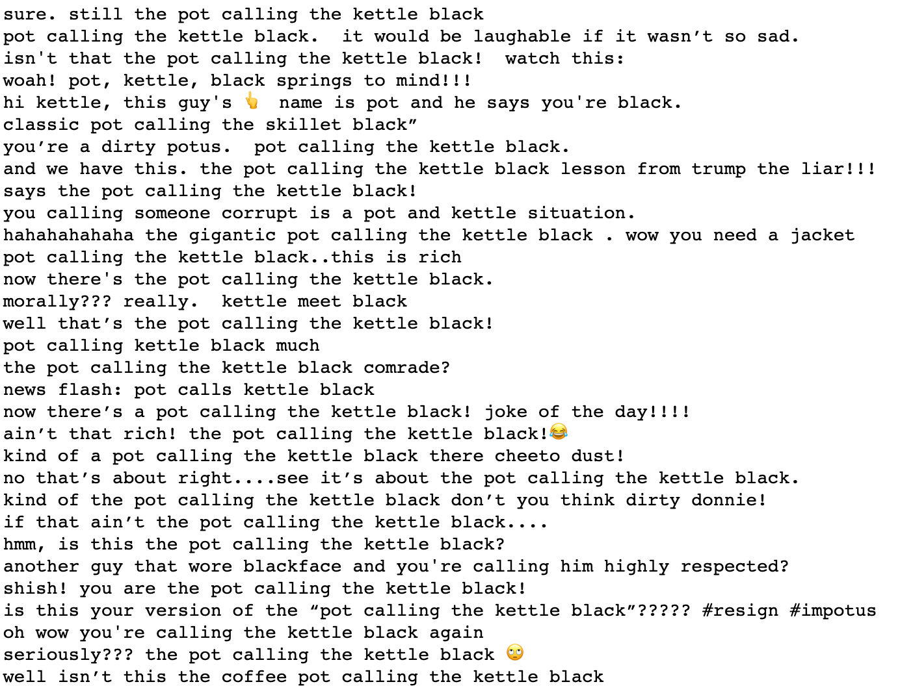

*This next one (below) is interesting. It found tweets where people typed words or sentences with spaces between each letter.*

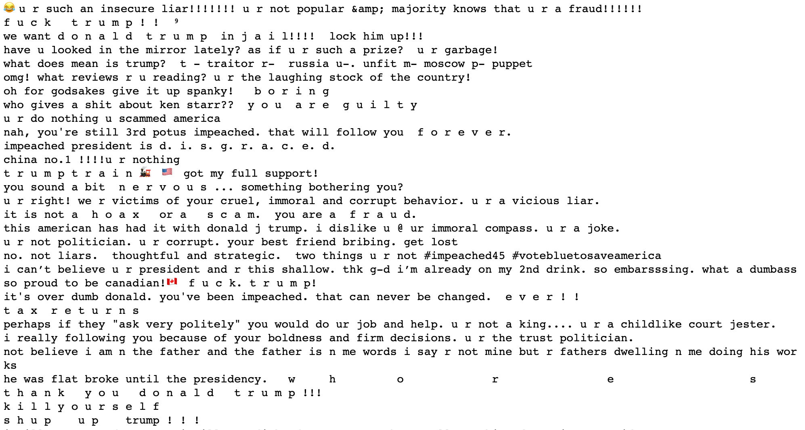

*Below is a cluster that identified “stfu” phraseology.*

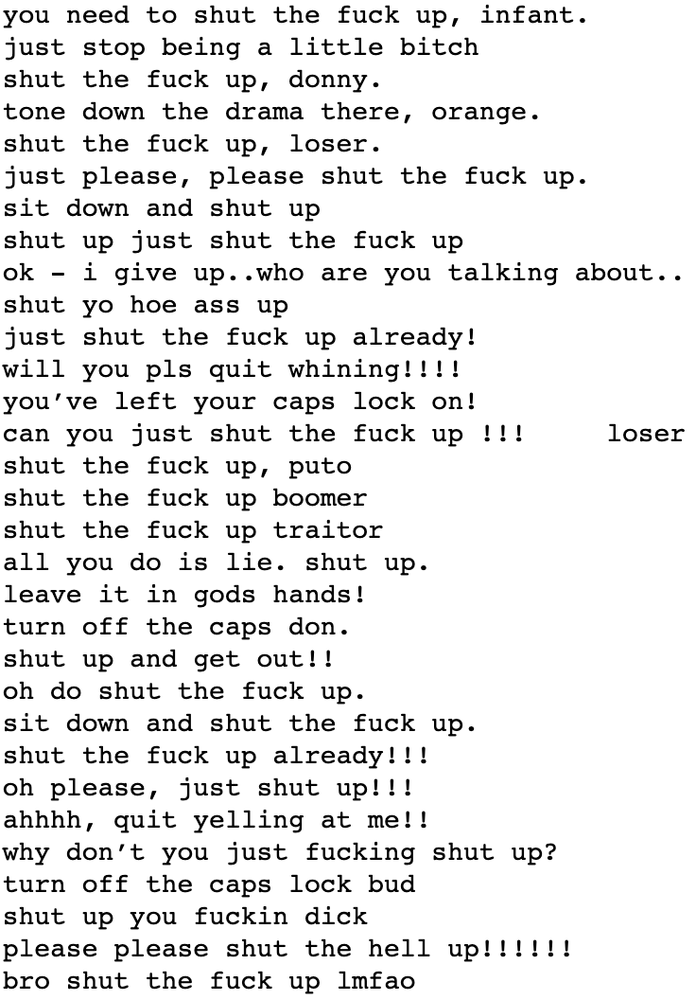

---
### Content regarding the recent Iranian situation

As mentioned in our methodology section (later in this article), the technique we’re using does sometimes identify multiple clusters containing similar subject matter. While looking through the clusters identified from replies to @realDonaldTrump, we found four clusters that all contained high percentages of tweets about a recent situation in Iran. Upon inspection we realized that those clusters contained different takes on the same issue.

*Below is a cluster that contains some tweets praising Trump’s actions in the region.*

*Below is a cluster that contains some tweets mentioning Iraq and related repercussions of actions against Iran.*

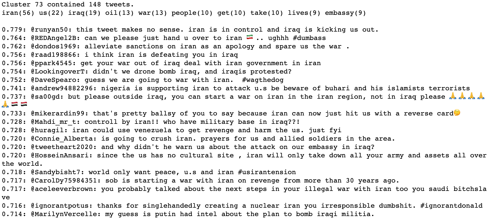

*Below is a cluster that contains mostly negative comments about Trump’s actions in the region.*

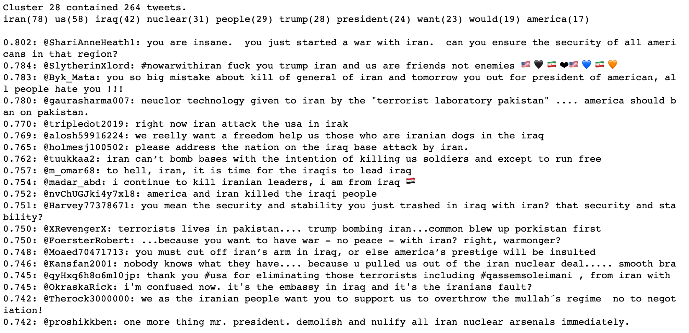

*And finally, the cluster below contains negative comments, some of which that are rather toxic.*

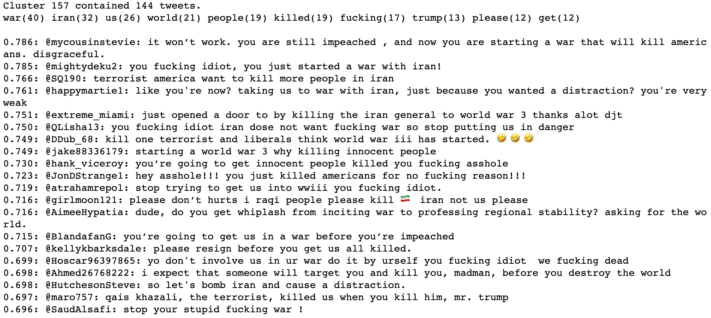

---
### Testing our methodology on different data

We tested our topic modeling methodology further by running the same toolchain on a set of tweets collected during the run-up to the UK elections. These were tweets captured on hashtags relevant to those elections (\#GE2019, \#generalelection2019, etc.). Our methodology turns out to be quite well-suited for finding spam. Here are a few examples:

*The output below contains tweets posted by an app called “paper.li”, which is a legitimate online service that folks can use to craft their own custom newspaper. It turns out there were a great deal of paper.li links shared on top of the \#ge2019 hashtag. Unfortunately, this was one of four clusters identified that contained similar-looking paper.li tweets (which could be found more easily by filtering collected Twitter data by source field).*

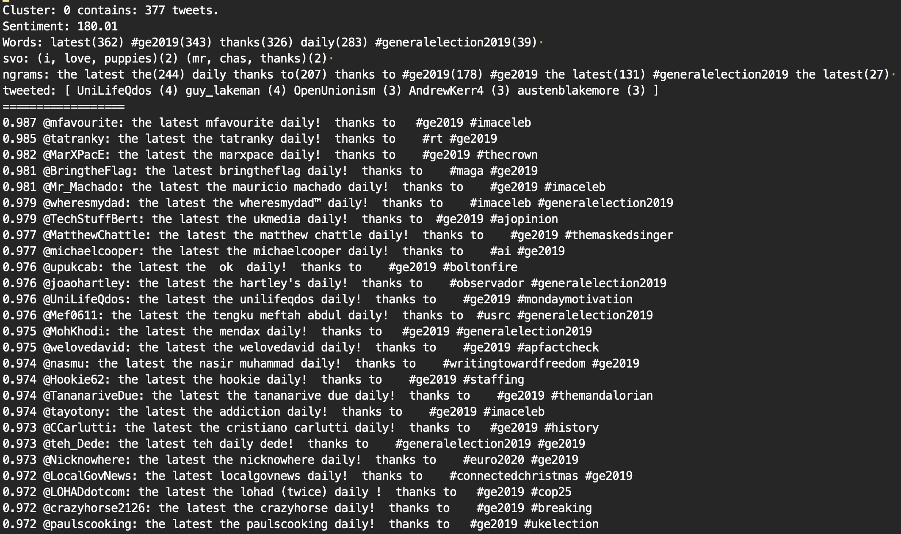

*Below we can see some copy-paste disinformation, all shared by the same user. Note that this analysis was run over roughly 30,000 randomly selected tweets from a dataset with millions of entries. As such, I might expect more from the same user.*

*Below we see some tweets advertising porn on top of the \#ge2019 hashtag. Spam advertisers always piggyback their tweets on trending hashtags, and the ones we captured trended often during the run-up to the 2019 UK general elections.*

*A cluster that identified a certain style of writing happened to identify tweets largely from one account. Rather useful.*

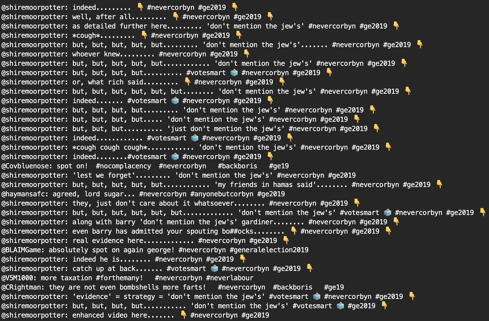

*The cluster below picked up on similar phraseology. Not sure what that was about.*

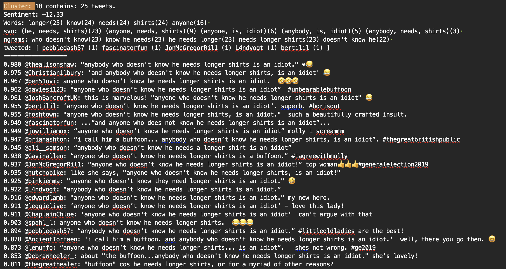

*Finally, several clusters (shown below) contained a great deal of tweets including the phrase “antisemitism”. Many of the accounts in those clusters could be classified as trolls and/or fake disinformation accounts.*

*Note that we found similar clusters in data collected by following Tory activist accounts / sockpuppets during the same time period (shown below):*

It’s worth noting that a portion of the accounts identified in our clustered data have been suspended since the data was originally collected. This is a good indication that some of the accounts replying to politicians, and participating in harassment are either fake, or are performing activities that break Twitter’s terms of service. Any methodology that allows such accounts to be identified quickly and accurately is of importance.

---

## Conclusions and future directions

The methodology developed for our experiments yielded a mechanism for grouping tweets with similar content into reasonably accurate clusters. It did a very efficient job at identifying similar tweets, such as those posted by coordinated disinformation groups, or from reply spammers, and from services that post content on behalf of a user’s account (such as paper.li or share buttons on web sites). However, it still suffers from a tradeoff between accuracy and the creation of redundant clusters. Further work is needed to refine the parameters and logic of this methodology such that it is able to assign groups of relatively rare tweets into small clusters, while at the same time creating large clusters of similar content, where appropriate.

In order to fully automate the detection of toxic content and online harassment, additional mechanisms must be researched and added to our toolchain. These include an automated method for summarizing the contents of a cluster, sentiment or stance analysis of the contents of a cluster, and a way of automatically assigning a verdict, label, or category to each cluster.

Further research into whether the identified clusters may be used to classify new content is another area worth exploring (initial experiments into this line of research are documented in appendix 2 of this article).

If these future goals can be completed successfully, a whole range of potential applications open up, such as, automated filtering or removal of toxic content, an automated method to assign scores to accounts based on the frequency at which they post toxic content or harass users, and the ability to track the propagation of toxic or trolling content on a social network (including, perhaps, behind-the-scenes identification of how such activity is being coordinated).

## Appendix 1: Detailed methodology

This section contains a detail explanation of the methodology we employed to cluster tweets based on their textual content. Since this section is fairly dry and technical, we opted to leave it until the end of this article. Feel free to skip it unless you’re interested in replicating it for your own means, are involved in similar research, or are both curious and patient

All the code used to implement this can be found at https://github.com/r0zetta/meta_embedding_clustering under the code/ subdirectory.

### 1\. Data collection, preprocessing, and vectorization

Twitter data was collected using a custom python script leveraging the Twarc module. The script utilized Twarc.filter(follow=*accounts\_to\_follow*) to follow a list of Twitter user\_ids, and only collect tweets that were direct replies to *accounts\_to\_follow* list provided. Collected data was abbreviated (a subset of all status and user fields were selected) and appended to a file on disk. Once sufficient data had been gathered, the collection was terminated, and subsequent analyses were performed on the collected data.

Collected Twitter data was read from disk and preprocessed in order to form a dataset of relevant tweets. Tweet texts were stripped of urls, @mentions, leading, and trailing whitespace, and then tokenized. If the tweet contained enough tokens, it was recorded, along with information about the account that published the tweet, the account that was replied to, and the tweet's status ID (in order to be able to recreate the original URL). Both the preprocessed tweet texts and tokens were saved during this process.

Three different sentence vectors were then calculated from each saved tweet:

1.  A word2vec model was trained on the tokenized tweets. Sentence vectors for each tweet were then calculated by summing the vector representations of each token in the tweet.

2.  A doc2vec model was trained on the preprocessed tweet texts. Sentence vectors were then evaluated for each preprocessed tweet text.

3.  XLNET vectors were calculated for each preprocessed tweet text using the model's encode function. Note that this can be a rather time-consuming process.

Sentence meta embeddings were then calculated by summing the three sentence vectors calculated for each tweet. The resulting sentence meta embeddings were then saved in preparation for the next step.

### 2\. Sample clustering

Our clustering methodology involves the following steps:

1.  Calculate a cosine similarity matrix between vector representations of the sentences meta embeddings for a batch of samples. This process generates a matrix of similarity values between all possible pairs of vectors in the sample batch.

2.  Calculate (or manually set) a threshold value at which we would draw an edge between two nodes in a graph.

3.  Find all vector pairs that have a cosine similarity equal to or greater than the threshold value. Create a node-edge graph from these values, setting the edge weight equal to the cosine similarity between that pair of vectors.

4.  Perform Louvain community detection on the resulting graph. This process labels each node based on the community it was assigned to.

5.  Process the results of the clustering - for instance, extract common words, n-grams, and subject-object-verb triplets.

6.  Perform manual inspection and statistical analysis of the resulting output.

Here is a diagram of the above process:

It is possible to perform reasonably fast (less than 10 seconds) in-memory cosine similarity matrix calculations on small sets (\<20000) using, for instance, the sklearn.metrics.pairwise cosine\_similarity function. However, larger sets of vectors that don't fit into memory require a calculation loop that can take anywhere between minutes and hours to run. In order to process our large sample sets, we opted to perform processing in batches using the following logic:

1.  Start with an array, *current\_batch*, populated with small *batch\_size* (e.g. 10,000) randomly selected sample vectors from the full set of samples to be clustered. We used randomly sampled vectors during all of our experiments so as to not optimize clustering logic for a deterministic set of inputs.

2.  Calculate an in-memory cosine similarity matrix between all vectors in *current\_batch*.

3.  Calculate a threshold cosine similarity value that will select the top (*batch\_size* \* *edges\_per\_node*) samples from *current\_batch*.

4.  Iterate through the cosine similarity matrix values found for vectors in *current\_batch*, adding pairs of nodes to a list, *graph\_mapping*, in the form \[source, target, cosine\_similarity\] for each pair whose cosine similarity was equal to or greater than the threshold value calculated in the previous step.

5.  Create a node-edge graph using the *graph\_mapping* list created in the previous step. Edge weights are assigned to the *cosine\_similarity* values obtained during that process. Run the Louvain community detection algorithm on the graph to obtain a list of nodes, labeled by community. This process will not utilize all of the vectors in *current\_batch*, so save a list of vectors that were not included in the resulting graph into a new list, *new\_batch*.

6.  Iterate through the communities found in the previous step, selecting the list of vectors that were assigned to each community.

7.  If the length of the list of vectors assigned to a community is less than the defined *minimum\_cluster\_size*, add those vectors to *new\_batch* and proceed to the next community.

8.  If the length of the list of vectors assigned to a community is equal to or greater than the defined *minimum\_cluster\_size*, continue processing that cluster.

9.  For each cluster that fits the *minimum\_cluster\_size* requirement, calculate a *cluster\_center* vector by summing all vectors in that cluster. Compare *cluster\_center* with a list of *cluster\_center* values found from previously recorded clusters. If the new cluster center has a cosine similarity value that exceeds a *merge\_similarity* value, assign items to the previously recorded cluster. If not, create a new cluster, and assign items to that.

10. Once all communities discovered in step 5 have been processed, add new samples from the pool to be processed to *new\_batch* until it reaches size *batch\_size*, assign it to *current\_batch*, and return to step 1. Once all samples from the pool have been exhausted, or the desired number of samples have been clustered, exit the loop.

### Failsafe

Occasionally, the loop runs without finding any communities that fulfill the *minimim\_cluster\_size* requirement. This, of course, causes the loop to go infinite. We added logic to detect this (check that the length of *new\_batch* is not the same as *batch\_size* before proceeding to the next pass). Our fix was to forcefully remove the first 10% of the array and append that many new samples to the end before proceeding to the next pass.

### Variable settings

Calculating a cosine similarity between large vectors is a memory-intensive task. However, different batch sizes result in quite different outcomes. If *batch\_size* is small, the selection of samples used to create each graph may not contain a wide enough variety of samples from the full set, and hence samples will be missed. If *batch\_size* is large, a great deal more communities are discovered. We found that setting *batch\_size* to 10,000 was optimal in terms of accuracy, speed, and memory efficiency.

The *edges\_per\_node* variable has a marked effect on the accuracy of the clustering process. When *edges\_per\_node* is set to a low value (1-3), less samples are selected from each batch, and community detection often finds many very small (e.g. 2-item) communities. However, when *edges\_per\_node* is set to higher values (\>6), a smaller number of larger communities are detected. However, these communities often contain multiple topics (and hence are inaccurate). We found that an *edges\_per\_node* value of 3 to be optimal for a *batch\_size* of 10,000. Increasing *batch\_size* often requires also increasing *edges\_per\_node* to achieve similar looking results.

The *minimum\_cluster\_size* variable affects the granularity of the final clustering output. If *minimum\_cluster\_size* is set to a low value, more clusters will be identified, but multiple redundant clusters may be created (that all contain tweets with similar subject matter). If accuracy is not important, setting *minimum\_cluster\_size* to a higher value will result in less clusters, and less redundancy, but may create clusters containing multiple topics, and may cause some topics to be lost. In datasets that contain a very wide range of different topics, a high *minimum\_cluster\_size* value (e.g. 50) may cause the process to not find any relevant communities. We found this variable to be very dataset-dependent. We tried values between 5 and 50, but ended up using a value of 50 for our experiments, mostly to allow for aesthetically pleasing visualizations to be created.

The *merge\_similarity* variable has a similar effect on the output as the *edges\_per\_node* variable discussed earlier. This variable dictates the threshold at which newly identified clusters are merged with previously discovered ones. At lower values, this variable may cause multiple different topics to be merged into the same cluster. At high values, more redundant topic clusters are created. In our setup, we set *merge\_similarity* to 0.98.

An example of a visualized graph (the one we generated using 30k tweets from set 1) looks like this:

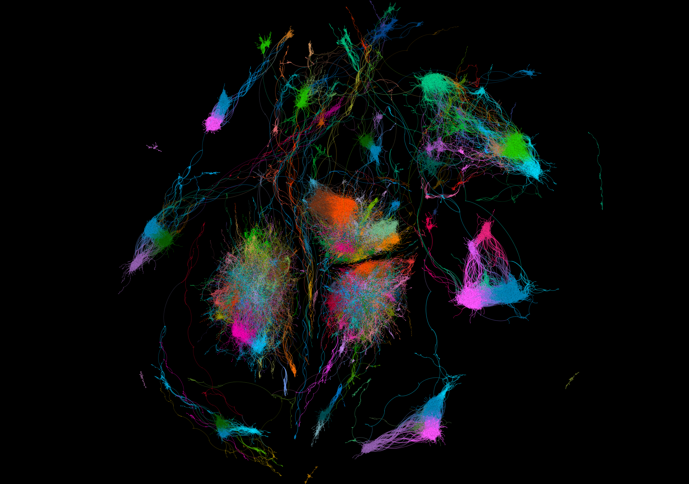

Here are a few examples of how the identified clusters map onto the visualized graph:

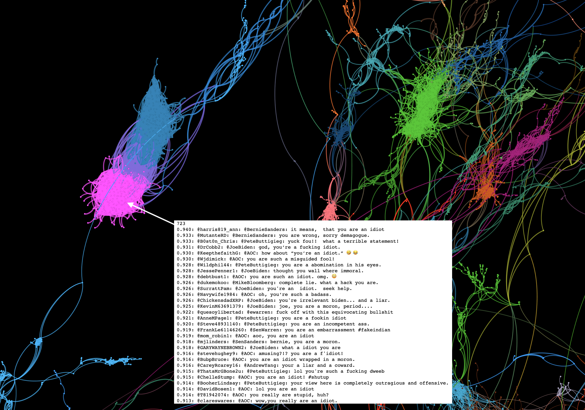

## Appendix 2: Experiment: Using identified clusters for new tweet classification

We experimented with the idea that identified clusters might be used to classify new tweets. In order to do this, we clustered approximately 25% of tweets from each dataset and then attempted to classify the entire captured dataset using the following process:

1\. For each tweet in the dataset, calculate meta embeddings using the same models and methods that were used to generate the clusters.

2\. Run cosine similarity between the new tweet's meta embedding and all previously identified cluster centers, and find the best match (highest cosine similarity score).

3\. If the cosine similarity exceeds a threshold, label that tweet accordingly. If not, discard it. In this case, we used a value of 0.65 as a threshold.

Set 1 (democrats):

184,851 (approximately 25% of the full dataset) tweets were clustered (using a *minimum\_cluster\_size* of 5) to obtain 3,376 clusters. The full 719,617 set of tweets were then converted into sentence meta embeddings and compared to the clusters found. This process matched 541,812 (75.29%) of the tweets.

Set 2 (realDonaldTrump):

188,010 (approximately 25% of the full dataset) tweets were clustered (using a *minimum\_cluster\_size* of 5) to obtain 3,894 clusters. The full 747,232 set of tweets were then converted into sentence meta embeddings and compared to the clusters found. This process matched 623,120 (83.39%) of the tweets.

By manually inspecting the resulting output (lists of tweet texts, grouped by cluster) we were able to determine that, in some cases, the newly classified tweets matched the original cluster topics fairly well. However, in some cases, they didn’t. As such, the identified cluster centers can’t reliably be used as a classifier to label new tweets from data captured with similar parameters. When using a threshold value higher than 0.65, a lot less tweets ended up being matched to existing clusters. One possible reason for the failure of this experiment is that some identified clusters contain tweets that only have very high cosine similarity values to the cluster center (above 0.95), whilst others contain tweets with much lower similarities (albeit whilst the content of the tweets match each other). As such, it might be that each cluster must have its own specific threshold value in order for this idea to work.
